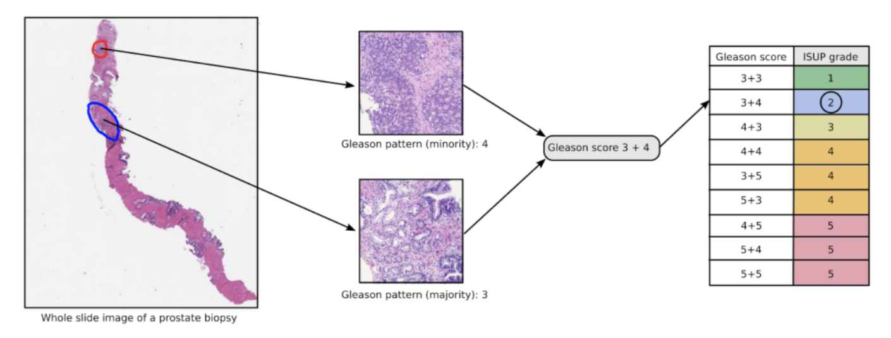

# [PANDA](https://www.kaggle.com/c/prostate-cancer-grade-assessment)-Prostate-cANcer-graDe-Assessment

The challenge in this Kaggle competition is to classify the severity of prostate cancer (Gleason Scores/ISUP Grades) from microscopy scans of prostate biopsy samples. 

Here are a few approaches I tried to approach the problem with brief description and achieved score on public leader board (Score is Quadratic Weighted Kappa (QWK) in this competition).

## Experiment #1 (0.47 on public LB)
- Used model: DenseNet121, trained from scratch
- No image augmentations
- Other settings:
  - Image size: 256 x 256 size patches of original image
  - No CV
  - 20 epochs
  - Batch size: 16 images

## Experiment #2 (0.51 on public LB)
- Used model: DenseNet121, pre-trained ImageNet weights
- Basic shift, scale, rotation and flips
- Other settings:
  - Image size: 256 x 256 size patches of original image
  - No CV
  - 25 epochs
  - Batch size: 16 images

## Experiment #3 (0.59 on public LB)
- Used model: DenseNet121, pre-trained ImageNet weights
- Basic shift, scale, rotation and flips
- Other settings:
  - Image size: 256 x 256 size patches of original image
  - 5 Fold CV
  - 25 epochs
  - Batch size: 16 images

## Experiment #4 (0.51 on public LB)
- Used model: DenseNet121, pre-trained ImageNet weights
- Basic shift, scale, rotation and flips
- Other settings:
  - Trained on Gleason score instead of directly on ISUP grades
  - Image size: 256 x 256 size patches of original image
  - No CV
  - 25 epochs
  - Batch size: 16 images
  
## Experiment #5 (0.60 on public LB)
- Used model: DenseNet121, pre-trained ImageNet weights
- Basic shift, scale, rotation and flips
- Other settings:
  - Image size: 256 x 256 size patches of original image
  - 5 Fold CV
  - 25 epochs
  - Batch size: 16 images
  - TTA (Test Time Augmentation)

## Experiment #6 (0.55 on public LB)
- Used model: DenseNet121, pre-trained ImageNet weights
- Basic shift, scale, rotation and flips
- Other settings:
  - Image size: 256 x 256 size patches of original image
  - No CV
  - 25 epochs
  - Batch size: 16 images
  - Label Smoothing
  
## Experiment #7 (0.56 on public LB)
- Used model: DenseNet121, pre-trained ImageNet weights
- Basic shift, scale, rotation and flips
- Other settings:
  - Image size: 256 x 256 size patches of original image
  - No CV
  - 25 epochs
  - Batch size: 16 images
  - Label Smoothing
  - TTA
  
## Experiment #8 (0.53 on public LB)
- Used model: DenseNet121, pre-trained ImageNet weights
- Basic shift, scale, rotation and flips
- Other settings:
  - Image size: 256 x 256 size patches of original image
  - 5-fold CV
  - 30 epochs
  - Batch size: 16 images
  - Label Smoothing
  - TTA
 
